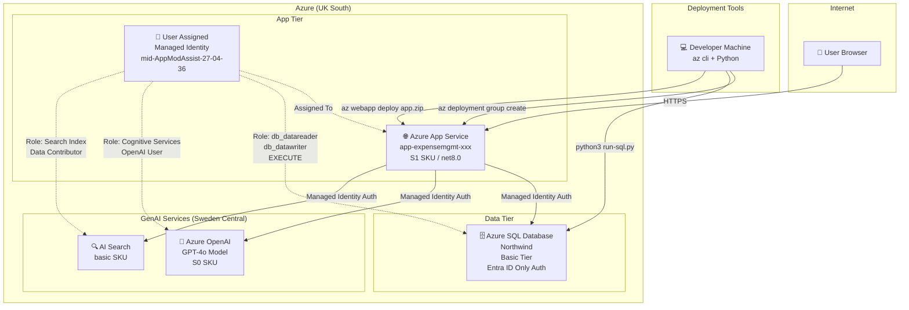

# Azure Services Diagram - Expense Management System

## Service Architecture



## Services Summary

| Service | Name Pattern | SKU | Region | Purpose |
|---------|-------------|-----|--------|---------|
| App Service Plan | `asp-expensemgmt-xxx` | S1 Standard | UK South | Hosts the web app |
| App Service | `app-expensemgmt-xxx` | - | UK South | ASP.NET Razor Pages + REST API |
| Managed Identity | `mid-AppModAssist-27-04-36` | User Assigned | UK South | Passwordless auth to all services |
| Azure SQL Server | `sql-expensemgmt-xxx` | - | UK South | SQL Server (Entra ID only) |
| Azure SQL Database | `Northwind` | Basic | UK South | Expense data storage |
| Azure OpenAI | `oai-expensemgmt-xxx` | S0 | Sweden Central | GPT-4o for AI assistant |
| AI Search | `srch-expensemgmt-xxx` | Basic | UK South | RAG pattern for chat |

## Connection Flow

```
Browser → App Service → SQL Database
                     → Azure OpenAI (for /chatui)
                     → AI Search (for /chatui RAG)

All authentication uses Managed Identity (no passwords or keys stored)
```

## Security Model

- **No SQL passwords**: Entra ID only authentication enforced
- **No API keys**: All Azure service connections use Managed Identity  
- **HTTPS only**: App Service configured with `httpsOnly: true`
- **TLS 1.2+**: Minimum TLS version enforced
- **Least privilege**: MI granted only required roles on each service

## Deployment Scripts

```bash
# Deploy without GenAI (app + database only)
chmod +x deploy.sh && ./deploy.sh

# Deploy with GenAI (full stack including OpenAI + AI Search)
chmod +x deploy-with-chat.sh && ./deploy-with-chat.sh
```

## Application URLs

After deployment, the app is accessible at:
- **Main UI**: `https://<app-name>.azurewebsites.net/Index`
- **API Docs**: `https://<app-name>.azurewebsites.net/swagger`
- **AI Assistant**: `https://<app-name>.azurewebsites.net/chatui`
